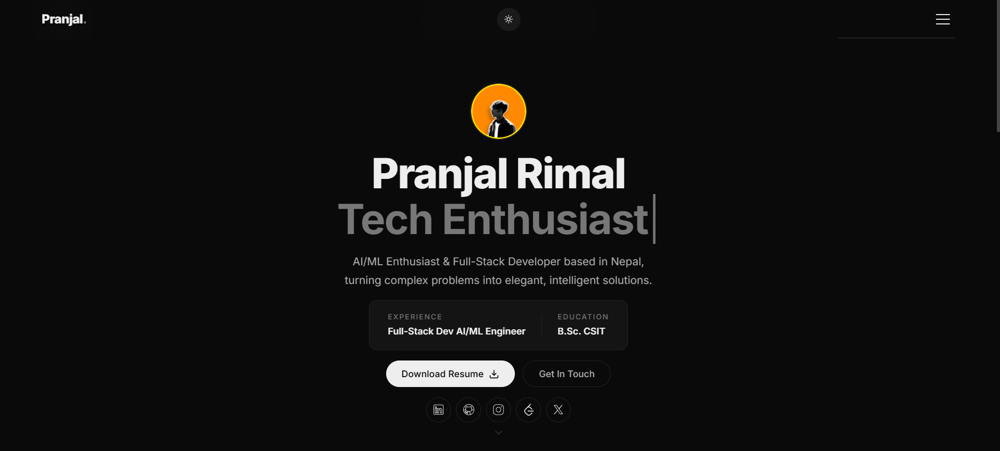

# Pranjal Rimal — Portfolio

My personal portfolio website. Built with plain HTML, CSS and JavaScript — no frameworks, no build tools.



**Live:** [pranjalrimal.com.np](https://pranjalrimal.com.np)

---

## Features

- Dark / light mode with localStorage persistence
- Responsive layout with mobile hamburger navigation
- Typing effect on the hero headline
- Scroll-triggered reveal animations
- Minimal, monochrome design (Inter + JetBrains Mono)
- No dependencies — just open `index.html`

---

## Project Structure

```
├── index.html              # main page
├── css/
│   ├── styles.css          # design system, components, dark mode
│   └── mediaqueries.css    # responsive breakpoints
├── js/
│   └── script.js           # theme toggle, typing effect, scroll reveals
├── assets/
│   ├── icons/              # social & UI svgs (github, linkedin, moon, sun…)
│   ├── images/             # profile photo, project screenshots, preview
│   └── docs/               # resume pdf
├── CNAME                   # custom domain for GitHub Pages
└── README.md
```

---

## Run Locally

```bash
git clone https://github.com/impranzal/Potrfolio.git
cd Potrfolio
```

Open `index.html` in a browser. That's it.

---

## Tech

| Layer        | What                          |
|--------------|-------------------------------|
| Structure    | HTML5                         |
| Styling      | CSS3 (custom properties)      |
| Scripting    | Vanilla JavaScript            |
| Fonts        | Inter, JetBrains Mono         |
| Icons        | SVG                           |
| Hosting      | GitHub Pages                  |

---

## Sections

- **Hero** — name, typing phrases, quick info card, resume download, socials
- **About** — bio, education, stat cards
- **Skills** — categorized skill tags (Core, AI/ML, Web, Tools)
- **Projects** — numbered project rows with thumbnails
- **Contact** — email, LinkedIn, GitHub cards
- **Footer** — site nav + copyright

---

## Customization

- Edit typing phrases in `js/script.js` → `typingPhrases` array
- Swap colors via CSS custom properties in `:root` and `body.dark-mode`
- Replace images in `assets/images/`, icons in `assets/icons/`
- Update resume at `assets/docs/resume.pdf`

---

## Contact

- [pranjalrimal.com.np](https://pranjalrimal.com.np)
- [github.com/impranzal](https://github.com/impranzal)
- [linkedin.com/in/pranzal](https://linkedin.com/in/pranzal)
- [pranjalrimal.np@gmail.com](mailto:pranjalrimal.np@gmail.com)
